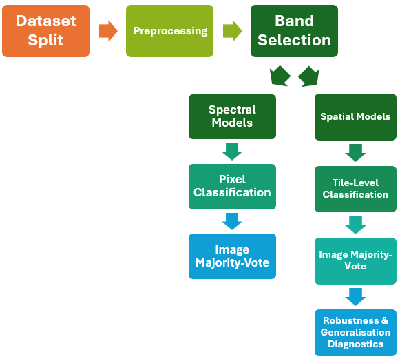

# Classification of Grain Varieties Using Hyperspectral Imaging and Deep Learning

This repository contains the code developed as part of the Master's thesis on grain variety classification using hyperspectral imaging (HSI).

The aim of the project is to investigate how much spectral and spatial information is required to reliably distinguish between different grain varieties, and how these findings can inform the design of reduced-band multispectral imaging systems.

## Project Structure

### `data_preparation.ipynb`

Data loading and preprocessing pipeline:

* Loading of hyperspectral cubes
* Foreground masking and background removal
* Spatial cropping
* Pixel sampling
* Dataset creation and train/validation/test split
* Validation of foreground-pixel sampling

### `spectral_exploration.ipynb`

Exploratory spectral analysis:

* Mean spectra visualisation
* Spectral preprocessing and mean centering
* Principal Component Analysis (PCA)
* PCA loading analysis
* Variable Importance in Projection (VIP) analysis
* PCA and VIP based wavelength selection
* Reduced-band spatial visualisations

### `spectral_classification.ipynb`

Pixel-level spectral classification experiments:

* PLS-DA baseline models
* Reduced-band classification using PCA-selected wavelengths
* Reduced-band classification using VIP-selected wavelengths
* RGB-like reference classification
* Model comparison across different spectral subsets
* Confusion matrices and performance metrics
* Image-level majority-vote classification
* Spatial analysis of pixel-level misclassifications

### Spatial Classification

`spatial_classification_custom_cnn.ipynb` and `spatial_classification_resnet18_cnn.ipynb`

Spatial classification experiments using a custom residual CNN and pretrained ResNet18:

* 1-band and 3-band PCA- and VIP-selected inputs
* RGB-like reference representation
* Image tiling and spatial standardisation
* Hyperparameter tuning and model training
* Tile-level and image-level evaluation

### Spatial Classification Diagnostics

`spatial_classification_custom_cnn_diagnostics.ipynb` and `spatial_classification_resnet18_cnn_diagnostics.ipynb`

Additional robustness and generalisation experiments for both CNN architectures:

* Gaussian-blur diagnostic
* Sample-volume generalisation
* Comparison across PCA, VIP, and RGB-like representations

### External Dataset Evaluation

`spatial_classification_custom_cnn_additional_data.ipynb` and `spatial_classification_resnet18_cnn_additional_data.ipynb`

Evaluation of the trained spatial classifiers on an independent hyperspectral corn dataset:

* External wavelength matching
* Application of the original preprocessing and trained models
* Image-level corn recognition without retraining

### `spatial_classification_extra_analysis.ipynb`

Additional visualisations and analyses used to interpret the spatial classification results.

### `hsi_utils.py`

Shared helper functions used throughout the project:

* Data loading
* Cube processing
* Foreground masking

### `overlay_plots/`

Saved pixel-level prediction overlays from the spectral classification experiments.

### Spatial Results Folders

Saved outputs from the custom CNN and ResNet18 experiments, including primary results, diagnostic results, and external-dataset evaluations.

## Experimental Setup

The following diagram outlines the overall pipeline of the experimental setup

